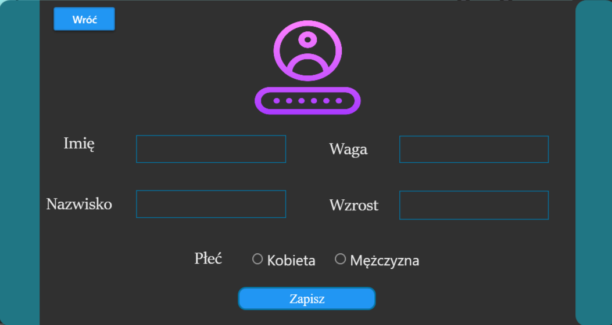

## Introduction

This application, developed in C#, is designed to facilitate fitness trainers (admins) in managing their clients' progress effectively. It allows admins to log in, track clients' progress, add, sort, and remove clients, view training history, and analyze statistics such as BMI and progress. Users can record either cardio or strength training sessions. Additionally, the app provides functionality to save data to a .txt file on the desktop and includes a refresh button for convenience.

## Technologies Used

- C# programming language
- MaterialDesignThemes (4.9.0)
- .NET Framework 6.0
- Visual Studio 2022

## Features

1. **Admin Login**: login functionality for admin access (Login: admin, Password: admin).
2. **Client Management**: Ability to add, sort, and remove clients.
3. **Progress Tracking**: Monitor clients' training progress over time.
4. **Training History**: View training history for each client.
5. **Statistics**: Calculate and display BMI and progress statistics for clients.
6. **Training Sessions**: Record and differentiate between cardio and strength training sessions.
7. **Data Export**: Option to save data to a .txt file on the desktop.
8. **Refresh Button**: Easily refresh the application for updated information.

## Usage

1. Launch the application.
2. Log in as an admin (Login: admin, Password: admin).
3. Add clients to the system.
4. Record clients' training sessions, specifying whether it's cardio or strength training.
5. Monitor clients' progress through statistics and training history.
6. Utilize the data export feature to save data to a .txt file.
7. Use the refresh button to update the application as needed.

Login Window, here you can log in as admin (Login: admin, Password: admin). Using a toggle button, you can switch the theme to dark mode and also exit the application.

In this window, you can manage clients by adding, removing, and sorting them, as well as view their training history, statistics, and rankings. Below are buttons for adding cardio and strength training sessions, and on the right side, there is an option to save to a .txt file. At the top of the application, there is a button to change the theme and a button to exit the application.

If you click the button ,,dodaj,, , a registration window for the trainee will appear. In this window you can add the trainee to the list. (Below Window with Dark Mode

## Authors
- Mikołaj Ziółkowski
- Katarzyna Wróbel
- Anna Golak

